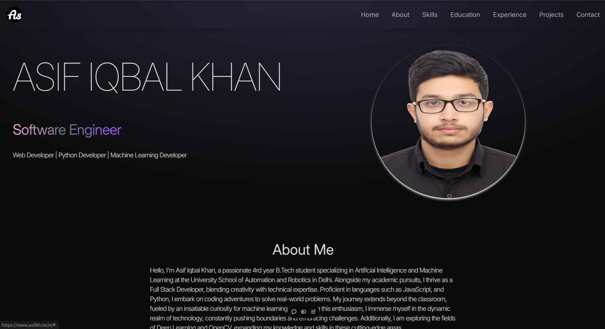

# My Portfolio

MyPortfolio is a personal website showcasing the projects, skills, and experiences of Asif Iqbal Khan. Built with React and Vite, it provides a responsive and interactive platform to present professional information.

  
*Homepage of MyPortfolio.*

## Features

- **Responsive Design**: Optimized for viewing on various devices and screen sizes.
- **Project Showcase**: Displays a curated list of projects with descriptions and links.
- **About Section**: Provides an overview of professional background and skills.
- **Contact Information**: Includes methods to get in touch.


## Installation

1. **Clone the Repository**:

   ```bash
   git clone https://github.com/ASIF-Kh/myPortfolio.git
   cd myPortfolio
   ```

2. **Set Up the Environment**:

   - Ensure you have Node.js installed (preferably version 14 or above).

3. **Install Dependencies**:

   ```bash
   npm install
   ```

4. **Run the Application**:

   ```bash
   npm run dev
   ```

   Access the application at `http://localhost:3000` in your web browser.


## Usage

- **Navigate Through Sections**: Explore different sections like About, Projects, and Contact.
- **View Projects**: Click on project links to view detailed information.


## Contributing

Contributions are welcome! Please fork the repository and create a pull request with your enhancements or bug fixes.

## License

This project is licensed under the MIT License. See the [LICENSE](LICENSE) file for more details.

## Acknowledgements

Special thanks to the open-source community and all contributors for their support.

---

For more information, visit the live application: [my-portfolio-khaki-psi-53.vercel.app](https://www.asifkh.tech/)


---

